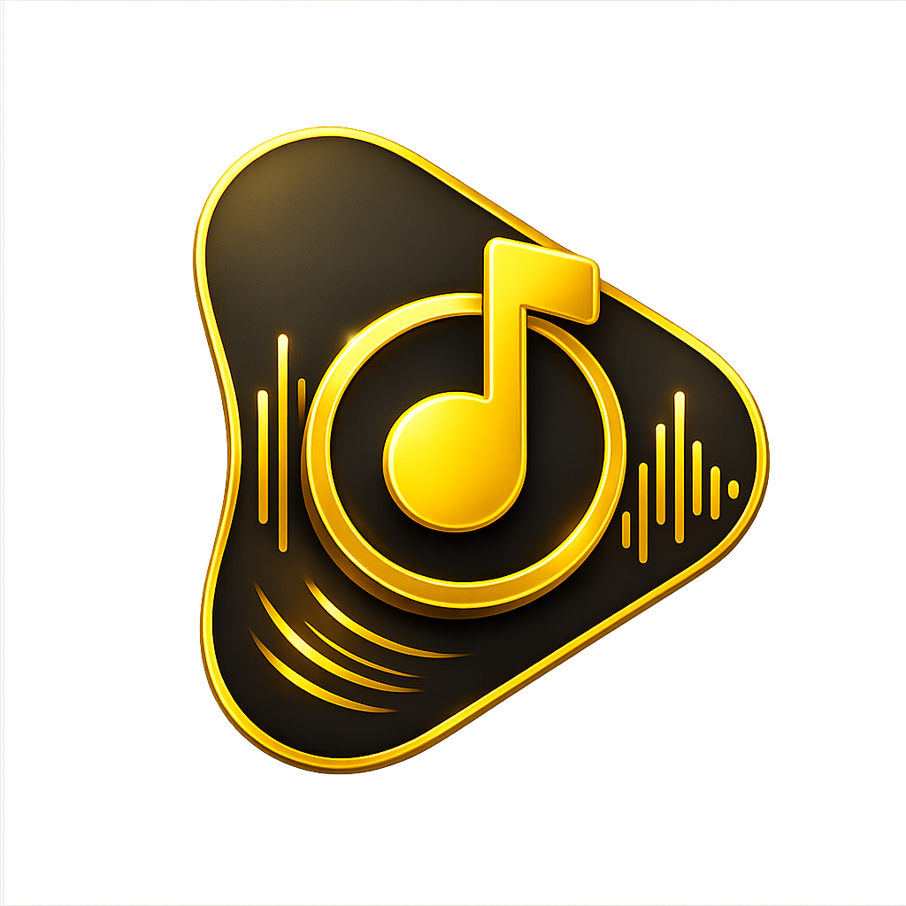
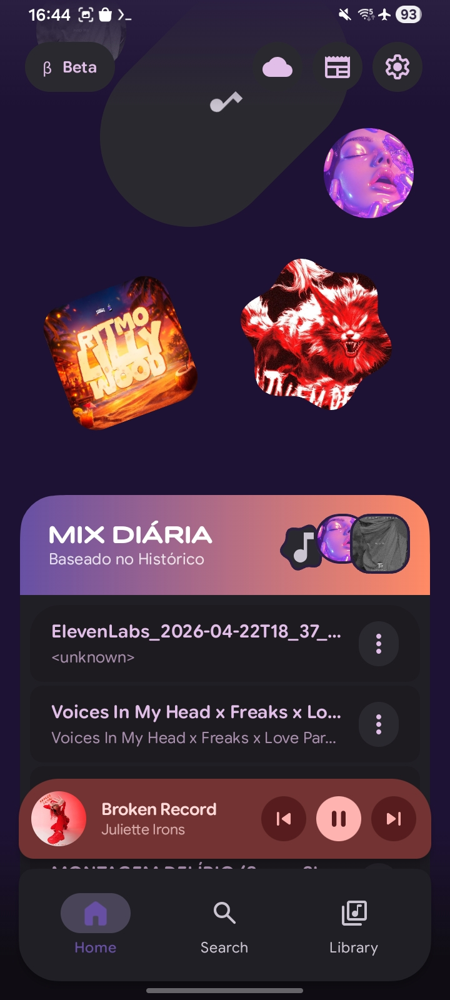
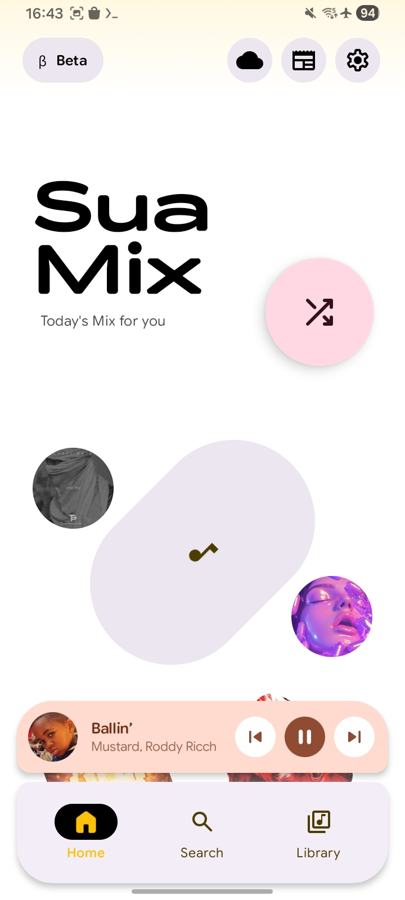
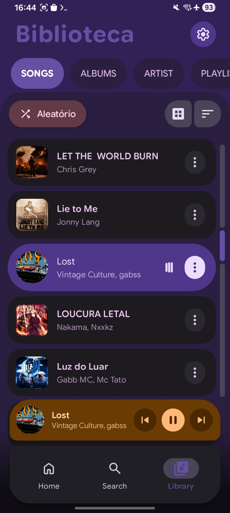
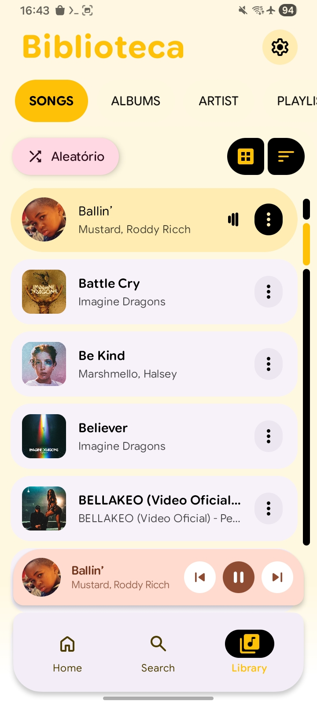
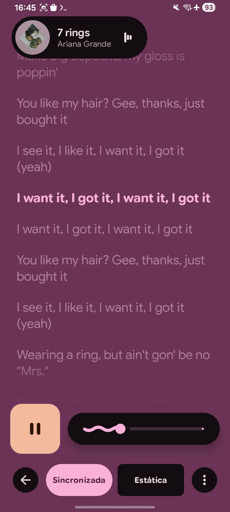
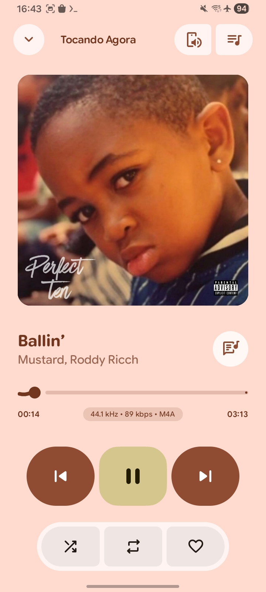

# Auris 🎶

<p align="center">
  
</p>

<p align="center">
  <strong>Um player de música bonito e repleto de recursos para Android</strong><br>
  Construído com Jetpack Compose e Material Design 3
</p>

<p align="center">
  
  
  
  
  
  
</p>

<p align="center">
    <a href="https://github.com/theovilardo/PixelPlayer/releases/latest">
        
    </a>
    <a href="https://github.com/theovilardo/PixelPlayer/releases">
        
    </a>
    
    
</p>

---

## ‼️ AVISO LEGAL
- Nenhum fork deste projeto receberá suporte. Se você utiliza um fork, peça ao responsável por ele para lhe ajudar.

---

## ✨ Funcionalidades

### 🎨 Interface Moderna (UI/UX)
- **Material You** – Cores dinâmicas que se adaptam ao seu papel de parede
- **Animações suaves** – Transições fluidas e microinterações
- **Interface personalizável** – Arredondamento de cantos e configurações da barra de navegação
- **Tema escuro/claro** – Alternância automática ou manual
- **Cores da capa do álbum** – Extração dinâmica de cores da arte do álbum

### 🎵 Reprodução Poderosa
- **Media3 ExoPlayer** – Motor de áudio líder da indústria com suporte a FFmpeg
- **Reprodução em segundo plano** – Total integração com a sessão de mídia
- **Gerenciamento de fila** – Reordenação por arrastar e soltar
- **Aleatório e repetição** – Todos os modos de reprodução suportados
- **Reprodução contínua (gapless)** – Transições perfeitas entre as faixas
- **Transições personalizadas** – Configure crossfades entre músicas

### 📚 Gerenciamento de Biblioteca
- **Suporte a múltiplos formatos** – MP3, FLAC, AAC, OGG, WAV e mais
- **Navegação por** – Músicas, Álbuns, Artistas, Gêneros, Pastas
- **Interpretação inteligente de artistas** – Separadores configuráveis para faixas com vários artistas
- **Agrupamento por Artista do Álbum** – Organização adequada dos álbuns
- **Filtragem de pastas** – Escolha quais diretórios escanear

### 🔍 Descoberta e Organização
- **Busca completa** – Pesquise em toda a sua biblioteca
- **Mistura Diária** – Playlist personalizada baseada nos seus hábitos de escuta (AI)
- **Playlists** – Crie e gerencie playlists personalizadas
- **Estatísticas** – Acompanhe seu histórico e hábitos musicais

### 🎤 Letras
- **Letras sincronizadas** – Formato LRC via API LRCLIB
- **Edição de letras** – Modifique ou adicione letras às suas faixas
- **Exibição em rolagem** – Acompanhe enquanto você ouve

### 🖼️ Arte do Artista
- **Integração com Deezer** – Imagens automáticas de artistas via API Deezer
- **Cache inteligente** – Cache em memória (LRU) + banco de dados para acesso offline
- **Ícones de substitutos** – Belos placeholders quando as imagens não estão disponíveis

### 📲 Conectividade
- **Chromecast** – Transmita para sua TV ou caixas inteligentes
- **Android Auto** – Suporte completo para reprodução no carro (Em breve)
- **Widgets** – Controle na tela inicial com widgets Glance

### ⚙️ Funcionalidades Avançadas
- **Editor de Tags** – Edite metadados com TagLib (suporte a MP3, FLAC, M4A)
- **Playlists com IA** – Gere playlists com o Gemini AI

---

## 🛠️ Stack Tecnológico

| Categoria | Tecnologia |
|----------|------------|
| **Linguagem** | [Kotlin](https://kotlinlang.org/) 100% |
| **Framework de UI** | [Jetpack Compose](https://developer.android.com/jetpack/compose) |
| **Design System** | [Material Design 3](https://m3.material.io/) |
| **Motor de Áudio** | [Media3 ExoPlayer](https://developer.android.com/guide/topics/media/media3) + FFmpeg |
| **Arquitetura** | MVVM com StateFlow/SharedFlow |
| **Injeção de Dependência** | [Hilt](https://dagger.dev/hilt/) |
| **Banco de Dados** | [Room](https://developer.android.com/training/data-storage/room) |
| **Rede** | [Retrofit](https://square.github.io/retrofit/) + OkHttp |
| **Carregamento de Imagens** | [Coil](https://coil-kt.github.io/coil/) |
| **Assíncrono** | Kotlin Coroutines & Flow |
| **Tarefas em Segundo Plano** | WorkManager |
| **Metadados** | [TagLib](https://github.com/nicholaus/taglib-android) |
| **Widgets** | [Glance](https://developer.android.com/jetpack/compose/glance) |

---

## 📱 Requisitos

- **Android 11** (API 30) ou superior
- **4 GB de RAM** recomendados para desempenho fluido

---

## 🚀 Primeiros Passos

### Pré-requisitos

- Android Studio Ladybug | 2024.2.1 ou mais recente
- Android SDK 29+
- JDK 11+

### Instalação

1. **Clone o repositório**
   ```sh
   git clone https://github.com/theovilardo/PixelPlayer.git
```

1. Abra no Android Studio
   · Abra o Android Studio
   · Selecione "Open an Existing Project"
   · Navegue até o diretório clonado
2. Sincronize e Compile
   · Aguarde o Gradle sincronizar as dependências
   · Compile o projeto (Build → Make Project)
3. Execute
   · Conecte um dispositivo ou inicie um emulador
   · Clique em Executar (▶️)

---

⬇️ Download

<p align="center">
  <a href="https://github.com/theovilardo/PixelPlayer/releases/latest">
    
  </a>
</p>

<p align="center">
  <a href="https://apps.obtainium.imranr.dev/redirect?r=obtainium://app/%7B%22id%22%3A%22com.theveloper.pixelplay%22%2C%22url%22%3A%22https%3A%2F%2Fgithub.com%2Ftheovilardo%2FPixelPlayer%22%2C%22author%22%3A%22theovilardo%22%2C%22name%22%3A%22PixelPlayer%22%2C%22supportFixedAPKURL%22%3Afalse%7D">
    
  </a>
</p>

---

📂 Estrutura do Projeto

```
app/src/main/java/com/theveloper/pixelplay/
├── data/
│   ├── database/       # Entidades Room, DAOs, migrações
│   ├── model/          # Modelos de domínio (Song, Album, Artist, etc.)
│   ├── network/        # Serviços de API (LRCLIB, Deezer)
│   ├── preferences/    # Preferências via DataStore
│   ├── repository/     # Repositórios de dados
│   ├── service/        # MusicService, servidor HTTP
│   └── worker/         # WorkManager para sincronização
├── di/                 # Módulos de injeção do Hilt
├── presentation/
│   ├── components/     # Componentes Compose reutilizáveis
│   ├── navigation/     # Grafo de navegação
│   ├── screens/        # Composables de tela
│   └── viewmodel/      # ViewModels
├── ui/
│   ├── glancewidget/   # Widgets da tela inicial
│   └── theme/          # Cores, tipografia, tematização
└── utils/              # Extensões e utilitários
```

---

🤝 Contribuindo

Contribuições são bem-vindas! Sinta-se à vontade para enviar um Pull Request.

1. Faça um Fork do projeto
2. Crie seu Branch de funcionalidade (git checkout -b feature/RecursoIncrivel)
3. Faça commit das suas alterações (git commit -m 'Adiciona um Recurso Incrível')
4. Faça push para o Branch (git push origin feature/RecursoIncrivel)
5. Abra um Pull Request

---

📄 Licença

Este projeto está licenciado sob a Licença MIT – veja o arquivo LICENSE para detalhes.

---

<p align="center">
  Feito com ❤️ por <a href="https://github.com/theovilardo">theovilardo</a>
</p>
